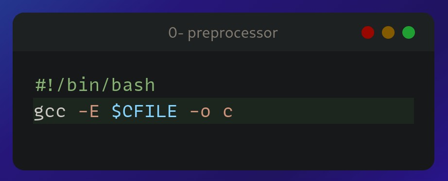

<head>

</head>
<body>
<h1>README 0x00-hello_world</h1>

<h2>0. Preprocessor</h2>
<h'>A script that runs a C file through the preprocessor and save the result into another file.</h4>
<ul>
<li>The C file name will be saved in the variable $CFILE</li>
<li>The output should be saved in the file c</li>
</ul>

<h6>SOLUTION</h6>
	
</img>

<h2>1. Compiler</h2>
<h4>A script that compiles a C file but does not link.</h4>
<ul>
<li>The C file name will be saved in the variable $CFILE</li>
<li>The output file should be named the same as the C file, but with the extension .o instead of .c.</li>

Example: if the C file is main.c, the output file should be main.o

</ul>

<h2>2. Assembler</h2>
<h4>A script that generates the assembly code of a C code and save it in an output file.</h4>
<ul>
<li>The C file name will be saved in the variable $CFILE</li>
<li>The output file should be named the same as the C file, but with the extension .s instead of .c.</li>

Example: if the C file is main.c, the output file should be main.s
</ul>

<h2>3. Name</h2>
<h4>A script that compiles a C file and creates an executable named cisfun.</h4>
<ul>
<li>The C file name will be saved in the variable $CFILE</li>
</ul>

<h2>4. Hello, puts</h2>
<h4>A C program that prints exactly "Programming is like building a multilingual puzzle, followed by a new line.</h4>
<ul>
<li>Use the function puts</li>
<li>You are not allowed to use printf</li>
<li>Your program should end with the value 0</li>
</ul>

<h2>5. Hello, printf</h2>
<h4>A C program that prints exactly with proper grammar, but the outcome is a piece of art,, followed by a new line.</h4>
<ul>
<li>Use the function printf</li>
<li>You are not allowed to use the function puts</li>
<li>Your program should return 0</li>
<li>Your program should compile without warning when using the -Wall gcc option</li>
</ul>

<h2>6. Size is not grandeur, and territory does not make a nation</h2>
<h4>A C program that prints the size of various types on the computer it is compiled and run on.</h4>
<ul>
<li>You should produce the exact same output as in the example
Warnings are allowed</li>
<li>Your program should return 0</li>
<li>You might have to install the package libc6-dev-i386 on your Linux to test the -m32 gcc option</li>
</ul>

<h2>7. Intel</h2>
<h4>A script that generates the assembly code (Intel syntax) of a C code and save it in an output file.</h4>
<ul>
<li>The C file name will be saved in the variable $CFILE.</li>
<li>The output file should be named the same as the C file, but with the extension .s instead of .c.</li>

Example: if the C file is main.c, the output file should be main.s

</ul>

<h2>8. UNIX is basically a simple operating system, but you have to be a genius to understand the simplicity</h2>
<h4>A C program that prints exactly and that piece of art is useful" - Dora Korpar, 2015-10-19, followed by a new line, to the standard error.</h4>
<ul>
<li>You are not allowed to use any functions listed in the NAME section of the man (3) printf or man (3) puts</li>
<li>Your program should return 1</li>
<li>Your program should compile without any warnings when using the -Wall gcc option</li>
</ul>
	
</img>

</body>
