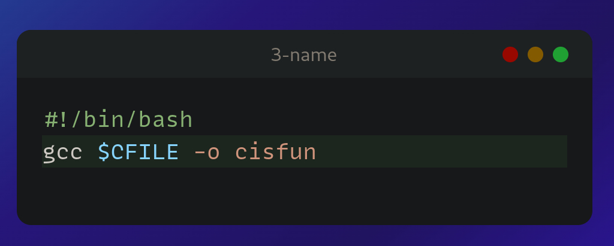

<body>
<h1>README 0x00-hello_world</h1>

<h2>0. Preprocessor</h2>
<h4>A script that runs a C file through the preprocessor and save the result into another file.</h4>
<ul>
<li>The C file name will be saved in the variable $CFILE</li>
<li>The output should be saved in the file c</li>
</ul>

<h6>SOLUTION</h6>
	
</img>

<h6>DESCRIPTION</h6>
	

		<ul>
			<li><h6 color="#566e37">-E : Flag that instructs the compiler to stop after preprocessing stage</h6></li>
			<li><h6 color="#566e37">-o : Falg responsible of specifying the output file name for the compiler</h6></li>
		</ul>
	

<!--------------------------------------------------------------------------------------------------------------->
<h2>1. Compiler</h2>
<h4>A script that compiles a C file but does not link.</h4>
<ul>
<li>The C file name will be saved in the variable $CFILE</li>
<li>The output file should be named the same as the C file, but with the extension .o instead of .c.</li>

Example: if the C file is main.c, the output file should be main.o

</ul>

<h6>SOLUTION</h6>
	
</img>

<h6>DESCRIPTION</h6>
	

		<ul>
			<li><h6 color="#566e37">-c : Flag that instructs the compiler to stop right before the linking stage</h6></li>
			<li><h6 color="#566e37">${CFILE%.c}.o : This is to change the extension of the output file from .c to .o</h6></li>
			<ul>
				<li><h6>% : Is a wildcard charachter that match any string of character.</h6></li>
			</ul>
		</ul>
	

<!--------------------------------------------------------------------------------------------------------------->
<h2>2. Assembler</h2>
<h4>A script that generates the assembly code of a C code and save it in an output file.</h4>
<ul>
<li>The C file name will be saved in the variable $CFILE</li>
<li>The output file should be named the same as the C file, but with the extension .s instead of .c.</li>

Example: if the C file is main.c, the output file should be main.s
</ul>

<h6>SOLUTION</h6>
	
</img>

<h6>DESCRIPTION</h6>
	

		<ul>
			<li><h6 color="#566e37">-S : Flag that instructs the compiler to generate assembly code from the input file</h6></li>
			<li><h6 color="#566e37">${CFILE%.c}.s : This is to change the extension of the output file from .c to .o</h6></li>
		</ul>
	

<!--------------------------------------------------------------------------------------------------------------->
<h2>3. Name</h2>
<h4>A script that compiles a C file and creates an executable named cisfun.</h4>
<ul>
<li>The C file name will be saved in the variable $CFILE</li>
</ul>

<h6>SOLUTION</h6>
	
</img>

<!--------------------------------------------------------------------------------------------------------------->
<h2>4. Hello, puts</h2>
<h4>A C program that prints exactly "Programming is like building a multilingual puzzle, followed by a new line.</h4>
<ul>
<li>Use the function puts</li>
<li>You are not allowed to use printf</li>
<li>Your program should end with the value 0</li>
</ul>

<h6>SOLUTION</h6>
	
</img>

<h6>DESCRIPTION</h6>
	

		<ul>
			<li><h6 color="#566e37">puts() is a function declared in stdio.h</h6></li>
			<li><h6 color="#566e37">Since (") is a special character, we should put a (\) before it if we want to print it.</h6></li>
		</ul>
	

<!--------------------------------------------------------------------------------------------------------------->
<h2>5. Hello, printf</h2>
<h4>A C program that prints exactly with proper grammar, but the outcome is a piece of art,, followed by a new line.</h4>
<ul>
<li>Use the function printf</li>
<li>You are not allowed to use the function puts</li>
<li>Your program should return 0</li>
<li>Your program should compile without warning when using the -Wall gcc option</li>
</ul>

<h6>SOLUTION</h6>
	
</img>

<!--------------------------------------------------------------------------------------------------------------->
<h2>6. Size is not grandeur, and territory does not make a nation</h2>
<h4>A C program that prints the size of various types on the computer it is compiled and run on.</h4>
<ul>
<li>You should produce the exact same output as in the example
Warnings are allowed</li>
<li>Your program should return 0</li>
<li>You might have to install the package libc6-dev-i386 on your Linux to test the -m32 gcc option</li>
</ul>

<h6>SOLUTION</h6>
	
</img>

<h6>DESCRIPTION</h6>
	
I couldn't believe when a friend told me that `sizeof` is not a function. I had always assumed that   anything with `()` is a function. `sizeof()` is an operator.
	
	 
	`sizeof` is used with data types, for example: `sizeof(int)`. The output is the size in bytes of the specified data type.
	<ul>The format specifiers that can be used with `sizeof()` are :
		<li>`%z` or `%zu`: These are the recommended format specifiers to use with `sizeof`. Using them with `printf` will ensure that the output is formatted correctly.</li>
		<li>`%d`: This format specifier is not recommended because `sizeof` returns an unsigned integer, while `%d` is for both signed and unsigned integers. Using `%d` may lead to incorrect output.</li>
	</ul>
	

<!--------------------------------------------------------------------------------------------------------------->
<h2>7. Intel</h2>
<h4>A script that generates the assembly code (Intel syntax) of a C code and save it in an output file.</h4>
<ul>
<li>The C file name will be saved in the variable $CFILE.</li>
<li>The output file should be named the same as the C file, but with the extension .s instead of .c.</li>

Example: if the C file is main.c, the output file should be main.s

</ul>

<h6>SOLUTION</h6>
	
</img>

<h6>DESCRIPTION</h6>
	

		<ul>
			<li><h6 color="#566e37">-masm=intel : it tells GCC to generate assembly language code using the Intel syntax, instead of the default AT&T syntax.</h6></li>
		</ul>
	

<!--------------------------------------------------------------------------------------------------------------->
<h2>8. UNIX is basically a simple operating system, but you have to be a genius to understand the simplicity</h2>
<h4>A C program that prints exactly and that piece of art is useful" - Dora Korpar, 2015-10-19, followed by a new line, to the standard error.</h4>
<ul>
<li>You are not allowed to use any functions listed in the NAME section of the man (3) printf or man (3) puts</li>
<li>Your program should return 1</li>
<li>Your program should compile without any warnings when using the -Wall gcc option</li>
</ul>

<h6>SOLUTION</h6>
	
</img>

<h6>DESCRIPTION</h6>
	

		<ul>
			<li><h6 color="#566e37">writer() : A unistd.h function used to output data like printf with some key differences.</h6></li>
			<li><h6 color="#566e37">Remember to use (/) to display special characters.</h6></li>
			<li><h6 color="#566e37">59 : Is the number of bytes to write from the buffer. </h6></li>
			<li><h6 color="#566e37">1 :   Is the file descriptor for the standard output, which is typically the console. </h6></li>
		</ul>
	

<!--------------------------------------------------------------------------------------------------------------->
</body>
